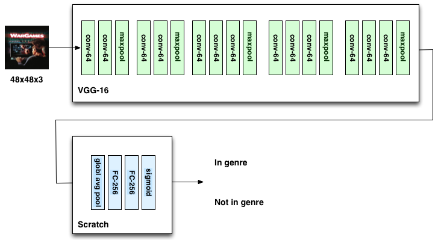

```{r setup, include=FALSE}
knitr::opts_chunk$set(echo = TRUE)
```

```{r echo=FALSE}
library(ggplot2)
```

```{r echo=FALSE}
# Load the performance data
mperf <- read.table('data/model_@_performance.tsv',
                    header=TRUE, sep='\t')

# Some numbers that can be computed from the confusion matrix
mperf$Test_GroundPos <- 
  mperf$Test_TruePos + mperf$Test_FalseNeg
mperf$Test_GroundNeg <- 
  mperf$Test_TrueNeg + mperf$Test_FalsePos
mperf$Test_NumObservations <- 
  mperf$Test_GroundPos + mperf$Test_GroundNeg

mperf$Test_BaseRate <- mperf$Test_GroundPos / 
  mperf$Test_NumObservations

mperf$Test_Precision <-
  (mperf$Test_TruePos) / (mperf$Test_TruePos + mperf$Test_FalsePos + 1e-10)
mperf$Test_Recall <-
  (mperf$Test_TruePos) / (mperf$Test_TruePos + mperf$Test_FalseNeg + 1e-10)

mperf$Test_FScore <- 2 * mperf$Test_TruePos /
  (2* mperf$Test_TruePos + mperf$Test_FalsePos + mperf$Test_FalseNeg)

cnn_perf <- read.table('model_perf.tsv', header=T, sep='\t')
```

```{r echo=FALSE}
genre_names <- c(
    'Animation',
    'Comedy',
    'Crime',
    'Documentary',
    'Drama',
    'Family',
    'Fantasy',
    'Foreign',
    'History',
    'Horror',
    'Music',
    'Mystery',
    'Romance',
    'Science_Fiction',
    'TV_Movie',
    'Thriller',
    'War',
    'Western'
)
train.baserate <- c(0.04844114, 0.201396,   0.05262913,
                    0.09781294, 0.28129362, 0.04271754,
                    0.02815263, 0.02680316, 0.01703118,
                    0.06454165, 0.04648674, 0.02680316,
                    0.08115403, 0.03476035, 0.01447185,
                    0.07915309, 0.01675198, 0.01912517)
test.baserate <- c(0.04988222,  0.19611103, 0.05223777,  
                   0.09824027,  0.28077225, 0.04447832,  
                   0.02780472,  0.02886703, 0.01704309,  
                   0.06872662,  0.04480163, 0.02706572,  
                   0.08059674,  0.0322387 , 0.01404092,
                   0.08175142,  0.01708928, 0.0159346)
baserates <- data.frame(genre=factor(genre_names, 
                                     levels=levels(cnn_perf$genre)),
                        train=train.baserate,
                        test=test.baserate)
```
# Introduction

This project uses the challenge of predicting movie genres as a way to
compare different types of models used in Machine Learning. We compare
several "traditional" models such as Random Forests and Support Vector
Classifiers, as well as a variety of Convolutional Neural Networks
trained on images of the movie posters.

# Methods

## Data Collection and Feature Extraction

Our data sources were two online databases, TMDb and IMDb. We regarded
TMDb as our main source, relying on its labels and poster image data;
significantly, we determined that the TMDb database id was
sufficiently randomly distributed that we could use its last digit to
divide our data consistently into training and test cohorts. [Our
intent was to reserve the last few digits (7, 8, and 9) for a final
"never-before-seen" assessment of our optimal model; as we never
reached the point of having a model worth that test, those movies
remain "in the vault."]

Because querying these databases is rate-limited, and because we
wanted to protect ourselves from last-minute discoveries that we
needed "just one more" column, we downloaded as much as we could at
the beginning of the project. Among the fields we retrieved were the
IMDb Id (allowing joins between the two data sources), to retrieve the
cast and crew, producer information, plot summary, keywords, budget,
revenue, release date, runtime, original language, and image data for
the poster.

Some fields required further processing in order to fit the needs of
the models. For example, we explored breaking out the `release_date`
into three _categorical_ predictors: one for the month of release
(e.g. to capture summer action films), one for the year mod 4, and one
for the year converted into a presidential term. We broke out the
latter two because there is a 4-year economic cycle and we thought
that they would capture the idea that different genres may have been
popular during different times -- but not in a way that is modeled by
"time moves forward." This seemed like an approach that might bear
fruit because so many cultural and economic developments in the US are
related to the presidential terms. These turned out not to be very
useful and we abandoned them in later stages.

It would be prohibitive to do a separate binary encoding of all of the
actors and directors, so we took a simpler approach to try and model
some people's "affinity" for certain genres. Within each genre, we
counted the number of films in the training set for each actor and
director, which we called their "genre affinity score". We discarded
those below a threshold of 10 (chosen based on visual inspection).
Finally, for each movie-genre combination, we took the sum of the
(surviving) actor-genre (or director-genre) affinity scores for all
actors (or directors) in that film. We called that the movie's
cast-genre-affinity score, and used it as a predictor.

Previous research (see
https://link.springer.com/chapter/10.1007/978-3-319-23989-7_8) has
shown that bag-of-word models are highly predictive for categorizing
IMDb movies. Thus, to examine this finding ourselves, we built
additional features by extracting bag-of-word features from IMDb's
movie overviews (the synopsis of a given movie), using the Natural
Language Toolkit (NTLK) package. We removed punctuation and stopwords
using the 50 corpora and lexical resources provided by the NTLK
package. We also treated the genre labels themselves as stopwords, to
avoid biasing the results. We took the 50 most frequent keywords and
created binary indicator columns for each. Visual inspection affirms
our belief that some keywords appear more in certain genres than
others. For example, "love" appears more often in Romance overviews,
while "fight" appears more in Action and Sci-Fi films.

In popular culture, we see that posters with dark, mysterious imagery
often correspond with Sci-Fi and horror films, while vibrant, more
simple imagery follows animation. We thought it would be interesting
to explore whether colors in movie posters are predictive for genre.
For use with traditional models, we converted images to HSV and
extracted the five most common values for each channel, although we
only used the single most common hue in our actual model development.

For our CNN models, we resized the poster images to a consistent and
manageable size of 48X48, and we augmented the image data by creating
a second version of each image, reflected left to right. For optimal
memory performance within Keras, we stored these data as pickled
numpy arrays.

We modeled the genres as a family of independent binary outcomes (for
example, a romantic comedy would have "True"/"1" for the
`genre_romance` and `genre_comedy` columns) for the following reasons:
1) This allows us to use the Hamming loss to better assess
partially-correct predictions, and the Macro-F1 score for evaluating
our models. 2) It eliminates the risk of creating a hand-curated list
of hybrid genres that will fail to predict some new fusion film that
might occur in the future. 3) It allows us to use our "genre affinity"
approach. 4) As various genres have different base rates of
occurrence, none of which are particularly large, by modeling each
genre separately we can mostly ignore the difference between genres'
base rates, and rely on separate class weights for each constituent
model. We can then build an ensemble model which uses the best model
for each genre. The best models for each movie genre might use
different classification algorithms (Logistic Regression, Random
Forest, SVC) and different sets of predictors.

## Traditional Models

For each movie genre, we created classification models using the
following algorithms:

**Dummy Models (most frequent, stratified)** -- Since we have highly
unbalanced classes, the simplest model always predicts `0`. It will
have no false positives and no true positives. This will be hard to
beat in terms of classification "accuracy", but is fairly useless.
Other metrics that consider both specificity and precision, such as
the F1 score, will be more useful. The stratified model predicts each
outcome randomly in proportion to its base rate; this has an F1-Score
equal to the base rate and is a practical baseline.

**Logistic Regression (LR)** -- We created several variations on
Logistic Regression models for each genre. We do not expect these to
be particularly effective, but they are quick to evaluate, accommodate
class weights, and also provide a simple baseline.

**Random Forest** - For this kind of classification problem, in which 
many different features are not directly comparable (how does the
presence of Alfred Hitchcock scale against runtime?) and interactions
are complicated, random
forests are potentially quite powerful, although the tuning/training
time is expensive. We allowed the tuner to run over a variety of
hyperparameters.

**Support Vector Classifier (SVC)** - Because of the heterogeneous
nature of our features, we expect the response to vary among small scale localities
of our feature space. We therefore used a Radial Basis Function
(RBF) kernel with coarse tuning of the Cost (C) and Gamma SVM
hyperparameters. Needless to say, these are also quite expensive to
train.

**Ensemble model** - Once we had evaluated the above models, the
ensemble model was built by taking the prediction, for each genre, of
the model that had the highest F-score on the _training_ data.

In training our models, we grouped our predictors into four groups:

* **Base 3** TMDb data for `budget`, `runtime`, and `revenue`. 
* **Hue** The most frequently occurring hue in the poster image, and the count of pixels which are that hue.
* **Genre Affinity** The set of genre affinity scores as defined above.
* **Overview** Bag-of-words encoding of the 50 most frequent words in the TMDb `overview` field.

Details can be found in Milestone 3.

## Convolutional Neural Networks (CNN) and Keras 

For the deep learning portion of the project, we construct an initial
"base" model with fairly "neutral" settings. Our intent is to perturb
each hyperparameter in turn to assess its impact on the results. Our
base model starts with VGG16, a publicly available, pre-trained
Convolutional Neural Network (CNN), which lets us leverage its image
feature extraction capabilities, particularly the generic image
features (color blobs, line edges, etc) encoded in its earlier layers.

\noindent 

The VGG16 portion of our base model consists of the VGG16 network with
its weights frozen and the `include_top` parameter set to `False`;
this omits its last three layers since we're not classifying the sort
of natural images in the ImageNet. Instead, we added a 2-D global
average pooling layer, two (2) 256-node FC layers using ReLU
activation, and a sigmoid (binary) classifier, since we're performing
binary classification for each movie genre.

We created a custom objective (loss) function to explicitly maximize
our F-Score. We chose not to use Keras's binary cross-entropy
objective function, due to the imbalanced nature of our data and since
we're trying to maximize FScore. As part of our assessment, we
determined that using our custom loss function resulted in higher test
F-scores than using Keras's function.

For the custom layers appended to VGG16, weights were initialized
using `he_normal`, the `Adam()` optimizer with default settings was
used, and L1 regularization with $\lambda = 10^{-5}$ was applied to
the second FC layer. Processing all images (21,000) in one batch
during training was deemed impractical due to computing resource
constraints, we chose a batch size of 256. We decided on 10 epochs
since we felt this would provide sufficient model training to compare
each model.

As described above, our image data was resampled to 48x48; one benefit
of using VGG16 is that it worked "out of box" with our resized images.
We note that Resnet and InceptionV3 wouldn't work with the lower
resolution images.

While our primary focus was to improve the performance of the VGG16-based
model, we created and evaluated a "from Scratch" model separately to
compare it with our base model. This model consisted of the following
flow: conv2D -> Maxpool -> flatten -> Dense (activation = relu) ->
Dense (activation = sigmoid)" with hyper-parameters configured as
closely as possible to our base model, to facilitate comparison. 

Once we had established a baseline using our initial model, we
investigated how model hyperparameters might affect performance by
evaluating model performance as we iterate over a range of values for
each hyperparameter in turn. Our comparison tool was a small-multuple
plot showing the train and test F-Score over the 10 epochs for each
combination of genre and hyperparameter value. (For details, please
see our Milestone 4 deliverable.) The hyperparameters varied were:

**Number of Nodes in the FC Layers** - We varied the number of nodes
in our custom FC layers as follows: (FC1, FC2) - (256,4) (256,64)
(256,256) (1024,64) (1024,256) (4096,4096). We noticed that models
with fewer nodes in the FC1/FC2 layers typically, but not always,
underperformed.
 
**Regularization** - Regularization is used to counteract overfitting,
so we experimented with both L1 and L2 regularization, varying
$\lambda$ by factors of 10. Predictably, setting $\lambda$ too high,
($10^{-4}$ for L1 and $10^{-2}$ for L2) results in a low and flat
F-Score plot, but setting it too low (such as $10^{-6}$) allows
overfitting.

**Learning rate** - We experimented with two dynamic learning rate
approaches: tuning functions: 1) A "Learning Rate Decay" function that
decayed after the first 5 epochs and 2) a "reduce learning rate on
plateau" function (RLROP) that used validation loss as feedback to
dynamically update the learning rate. The general idea is that
learning rate should decrease over epoch runs since the model should
be converging. We observed that RLROP performed significantly better
than "Learning Rate Decay", although we note that RLROP, uniquely in
our experiments, introduces a dependency on the test data and we
should have re-validated those results on a separate test set.
 
**Retraining** - Movie poster images have many of the same low-level
features as natural images, but their higher-level structure is
somewhat different. We considered that allowing the final 2 or 3
layers of VGG-16 to be retrained while keeping the lower layers frozen
would account for this.

# Results

We compare our F-Score on the test cohort for every model and every genre. The best-performing model for each genre is highlighted in red:

```{r fig.height=7,fig.width=3,echo=FALSE}
mperf$Is_Max_Test_FScore <- merge(mperf,
                                  aggregate(Test_FScore ~ Genre,
                                            data = mperf,
                                            FUN = max),
                                  by='Genre')$Test_FScore.y == mperf$Test_FScore

g <- ggplot(mperf[as.integer(mperf$Genre) <= 10,]) +
  geom_point(aes(y=Test_FScore, x=as.integer(Model_Name), color=Is_Max_Test_FScore)) +
  scale_x_continuous(breaks=1:16) +
  scale_y_continuous(limits=c(0, 0.5), breaks=c(0, 0.5)) +
  scale_color_manual(values=c('black', 'red'), guide=FALSE) +
  facet_grid(Genre ~ .) +
  theme(strip.text.y = element_text(angle=0)) + # unrotate facet labels
  # theme(axis.text.x = element_text(angle = 30, hjust = 1))
  labs(title='F-Score by Model & Genre',
       x='Model', y='F-Score')
 ggsave('ms5-trad-left.png', g, height=3, width=3.2, units='in')

g <- ggplot(mperf[as.integer(mperf$Genre) >= 11,]) +
  geom_point(aes(y=Test_FScore, x=as.integer(Model_Name), color=Is_Max_Test_FScore)) +
  scale_x_continuous(breaks=1:16) +
  scale_y_continuous(limits=c(0, 0.5), breaks=c(0, 0.5)) +
  scale_color_manual(values=c('black', 'red'), guide=FALSE) +
  facet_grid(Genre ~ .) +
  theme(strip.text.y = element_text(angle=0)) + # unrotate facet labels
  # theme(axis.text.x = element_text(angle = 30, hjust = 1))
  labs(title='F-Score by Model & Genre',
       x='Model', y='F-Score')
 ggsave('ms5-trad-right.png', g, height=3, width=3.2, units='in')
 
# levels(mperf$Model_Name)
```

\noindent 


**Models**: **1.** LogReg using 3 base predictors only;  **2.** LogReg unbalanced w/3 predictors; **3.** LogReg unbalanced w/3 predictors and base\_rate\_cutoff; **4.** LogReg unbalanced w/Hue; **5.** LogReg unbalanced w/Hue and base\_rate\_cutoff; **6.** LogReg w/affinity and overview\_features; **7.** LogReg w/affinity predictors; **8.** LogReg w/Hue;
**9.** Most Frequent (Dummy);
**10.** RandomForest; **11.** RandomForest optimizing for Fscore; **12.** RandomForest w/H;
**13.** Stratified (Dummy);
**14.** SVC; **15.** SVC optimizing for Fscore; **16.** SVC w/Hue

In most genres, the Random Forest optimized for F-Score (11) did the best; on almost all of the others one of the SVC variants was the best. In general, those two families of models outperformed the Logistic Regression by a notable amount, but `Romance` and `Comedy` show that occasionally even a Logistic Regression model can outperform more sophisticated models.

By combining the "best of genre" models, we arrived at our ensemble model. Its confusion matrix was:

```
        predicted_1 predicted_0
 true_1    12,376     18,026
 true_0   114,829    379,989
```
and its Macro-F1 score is 0.574.

## CNNs

Our CNNs were trained on those movies with ids ending in 0, and tested on those with ids ending in 2. There were approximately 21,000 movies in each cohort, and their base rates for each genre were approximately equal.

We examine the F-Score computed on the test data over ten epochs. Each chart compares several variants to the "base" model. The dashed line shows the base rate, which is also the theoretical F-Score of a stratified dummy model. We omit those genres with baserates under 5% because their models often fail to predict _any_ positive outcomes, and thus their F-Score is undefined.

```{r fig.height=6,echo=FALSE,eval=FALSE}
genres <- baserates$genre[baserates$train>0.05]
ggplot(cnn_perf[cnn_perf$FC1 == 256 & cnn_perf$FC2 == 256 &
                  cnn_perf$genre %in% genres
                  ,]) +
    geom_hline(data=baserates[baserates$genre %in% genres,], 
               aes(yintercept=train), 
               color='black',  linetype="dashed") +
    geom_line(aes(x=epoch, y=train_fscore, color='Train')) +
    geom_line(aes(x=epoch, y=test_fscore, color='Test'))  +
    facet_grid(genre ~ variant + Regularizer) +
    scale_x_continuous(limits=c(0, 10), breaks=seq(5, 10, 5)) +
    theme(strip.text.x = element_text(angle=90)) + # rotate top facet labels
    theme(strip.text.y = element_text(angle=0)) + # unrotate facet labels
    labs(title=paste0('TITLE TODO'),
         y='F score')

```

```{r fig.height=2,echo=FALSE}
cnn_perf <- cnn_perf[
  cnn_perf$variant == 'base'  |
  (cnn_perf$FC1 == 256 & cnn_perf$FC2 == 256)
  ,
]
genres <- baserates$genre[baserates$train>0.05]
cnn_perf$varReg <- as.character(cnn_perf$variant)
cnn_perf$varReg[startsWith(as.character(cnn_perf$variant), 'regularizer')] <- 
  paste(as.character(cnn_perf$variant), cnn_perf$Regularizer)[
    startsWith(as.character(cnn_perf$variant), 'regularizer')]
cnn_perf$varReg[cnn_perf$FC1 != 256 | cnn_perf$FC2 != 256] <-
  paste0('FC ', cnn_perf$FC1, 'x', cnn_perf$FC2)[
    cnn_perf$FC1 != 256 | cnn_perf$FC2 != 256]
cnn_perf$varReg <- as.factor(cnn_perf$varReg)

test.compare <- function(title, varReg.to.use) {
  ggplot(cnn_perf[cnn_perf$genre %in% genres &
                  cnn_perf$varReg %in% varReg.to.use &
                  cnn_perf$epoch <= 10
                  ,]) +
    geom_hline(data=baserates[baserates$genre %in% genres,], 
               aes(yintercept=train), 
               color='black',  linetype="dashed") +
    geom_line(aes(x=epoch, y=test_fscore, color=varReg))  +
    facet_grid(~ genre) +
    scale_x_continuous(limits=c(0, 10), breaks=seq(5, 10, 5)) +
    labs(title=title, y='F score')
}
# print(levels(cnn_perf$varReg))
#  [1] "100 epochs Reduce LR on Plateau" "base"                            "batch128"                       
#  [4] "batch64"                         "BCE loss"                        "BCE loss No Reg"                
#  [7] "FC 1024x256"                     "FC 1024x64"                      "FC 256x1024"                    
# [10] "FC 256x4"                        "FC 256x64"                       "FC 4096x4096"                   
# [13] "LR decay"                        "Reduce LR on Plateau"            "regularizer L1 L1=0e"           
# [16] "regularizer L1 L1=1e-4"          "regularizer L1 L1=1e-6"          "regularizer L2 L2=1e-2"         
# [19] "regularizer L2 L2=1e-4"          "regularizer L2 L2=1e-5"          "regularizer L2 L2=1e-6"         
# [22] "regularizer NoReg"               "scratch"                         "VGG w/16 frozen layers"         
# [25] "VGG w/17 frozen layers"          
```

```{r fig.height=2,fig.width=8,echo=FALSE}
test.compare("Comparing Regularization in CNN",
  c("regularizer NoReg", "regularizer L1 L1=1e-4", "base", "regularizer L1 L1=1e-6",
    "regularizer L2 L2=1e-4", "regularizer L2 L2=1e-5",  "regularizer L2 L2=1e-6"))
```

```{r fig.height=2,fig.width=8,echo=FALSE}
test.compare("Comparing Learning Rate in CNN",
  c("base", "LR decay", "Reduce LR on Plateau"))
```

```{r fig.height=2,fig.width=8,echo=FALSE,warning=FALSE}
test.compare("Comparing FC Size in CNN",
  c("base", "FC 1024x256", "FC 1024x64", "FC 256x1024", "FC 256x4", "FC 256x64", "FC 4096x4096"))
```

```{r fig.height=2,fig.width=8,echo=FALSE}
test.compare("Comparing Unfreezing layers in CNN",
  c("base", "VGG w/17 frozen layers", "VGG w/16 frozen layers"))
```

```{r fig.height=2,fig.width=8,echo=FALSE}
test.compare("Comparing Loss Functions in CNN",
  c("base", "BCE loss", "BCE loss No Reg"))
```

```{r fig.height=2,fig.width=8,echo=FALSE,warning=FALSE}
#test.compare("Comparing Batch Sizes in CNN",
#  c("base", "batch64", "batch128"))
```

# Discussion

**Regularization** We find that $\lambda_2\approx 10^{-6}$ scores the best, although $\lambda_1\approx 10^{-6}$ shows a nice gentle improvement over several epochs.

**Learning Rate** LR decay clearly loses in this case, while RLROP sometimes outperforms a flat learning rate.

**FC Size** The largest network, 4096x4096, is often the worst performer (presumably because it facilitates overfitting on the training set despite some amount of L1 regularization.) While the specifics vary from genre to genre, the 1024x256 and 256x64 models offer the right balance between having enough free parameters to produce a sufficiently rich model, without having so many as to allow overfitting.

**Unfreezing VGG Layers** The partially unfrozen layers seem to outperform the base model in general. This is not too surprising, since we increase the number of parameters simply by unfreezing, but they do not tend to overfit, implying that the retraining does update the pretrained model to optimize for high-level features found on movie posters.

**Loss Function** Our choice to start off with the F-Score-based loss function shows a clear benefit here.

# Conclusion

Our best performing CNN model came close to, but did not outperform, the best models created earlier with more traditional Machine Learning methods such as SVCs and Random Forests. In all cases, however, time limitations prevented us from optimally tuning our models, so it is hard to tell which would have prevailed. The F-Score-based objective function had a larger effect than any of the other hyperparameters that we varied. It is also worth emphasizing that the "traditional" models used movie metadata while our CNN model used only image data. We expect that a model that merged the CNN and meta-data features would surpass both.

We trained several dozen models and assessed their performance. We learned that there is no single best tool, even when looking at subsets of the same problem with the same data set. Ensemble models allow the strengths of each model to offset the weaknesses of others.
