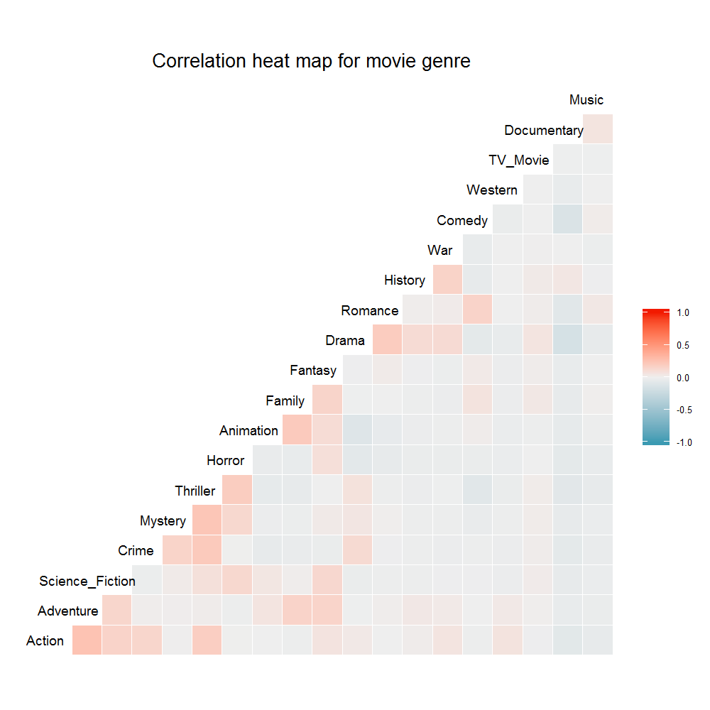
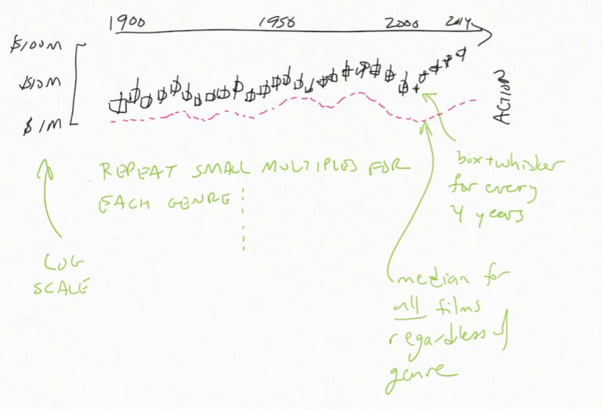
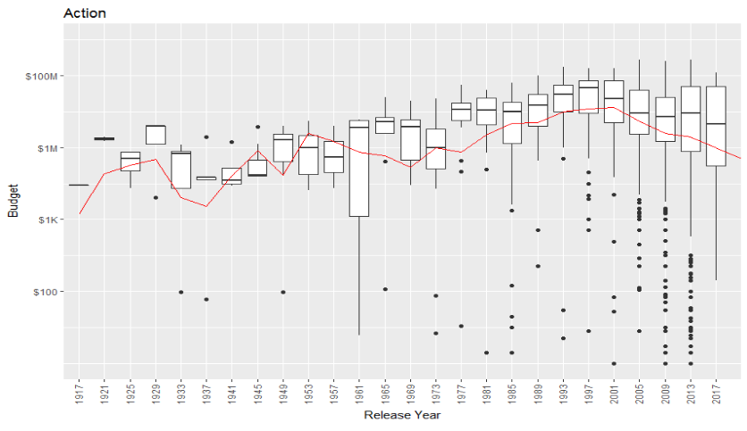
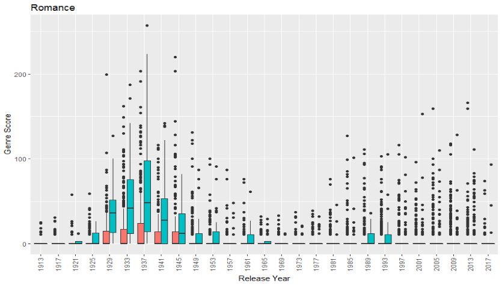
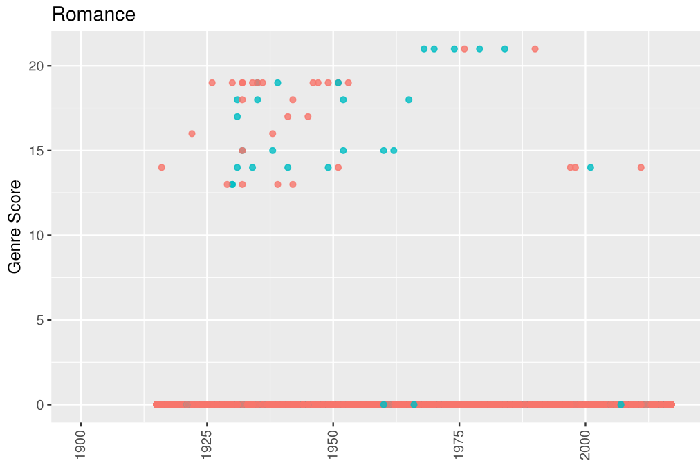
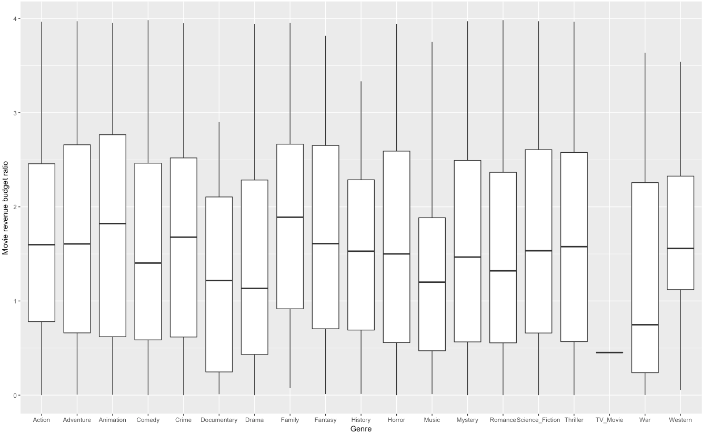
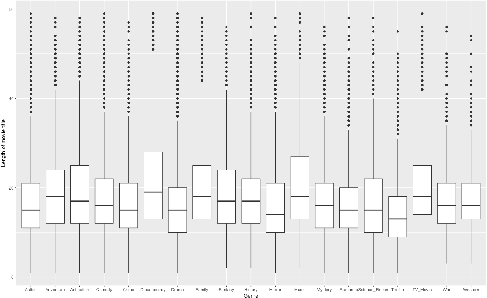
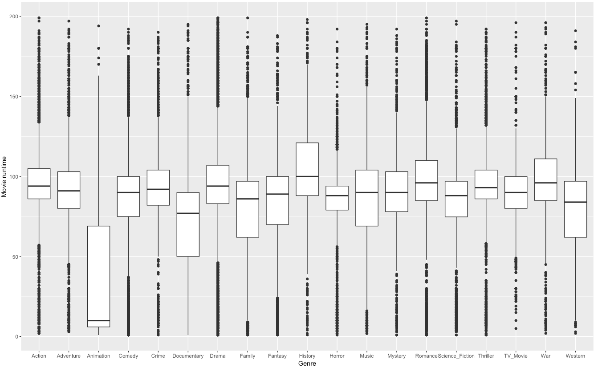

```{r setup, include=FALSE}
knitr::opts_chunk$set(echo = TRUE)
```

# API Exercises

_API code to access the genre and movie poster path of your favorite movie_

We used the `tmdbsimple` package as a wrapper to access TMDb.

```{python eval=FALSE}
import tmdbsimple as tmdb
tmdb.API_KEY = '' # Actual key not included in this report.

#  Search on 'War Games' and return TMDb movie ID and release date
#  Note: There may be multiple multiple responses to our search query
#  so the release date will help identify the correct TMDb movie id
search = tmdb.Search()
response = search.movie(query='War Games')
for s in search.results:
   print(s['title'], s['id'],  s['release_date'])

#  The movie id for War Games is '860'
wargames_tmdbmovie = tmdb.Movies(860)
response = wargames_tmdbmovie.info()

#  Obtain the genre
print wargames_tmdbmovie.genres

#  Print the poster path
response = wargames_tmdbmovie.info()
wargames_poster_path = wargames_tmdbmovie.poster_path
print wargames_tmdbmovie.poster_path
```

_Genre for this movie listed by TMDb and IMDb_

**Note:** We obtained the TMDb movie genre list for our favorite movie in the previous Python code snippet.  For this part below, we used the IMDbPY package as wrapper to access the IMDb API.

We have chosen the movie _WarGames_, a 1983 cautionary tale about machine
learning and relying too much on sophisticated autonomous computer models.

```{python eval=FALSE}
from imdb import IMDb
movieimdb = IMDb()

s_result = movieimdb.search_movie('War Games')
for item in s_result:
   print item['long imdb canonical title'], item.movieID

wargames_imdbmovie = movieimdb.get_movie('0086567')
print wargames_imdbmovie['genres']
```

The IMDb genre classification for _WarGames_: Sci-Fi, Thriller

TMDb genre classification for _WarGames_: Thriller, Science Fiction


_A list of the 10 most popular movies of 2016 from TMDb and their genre obtained via the API_

```{python eval=FALSE}
# This code block depends on the tmdb variable, which was initialized above.
# Use TMDb discover method to obtain the 10 most popular movies of 2016
discover = tmdb.Discover()
discover_response = discover.movie(
    primary_release_year=2016, 
    sort_by='popularity.desc')

print "Movie Title:Genre(s)"
for d in discover.results[0:10]:
    print d['title'] + ': ' + ', '.join([genres_by_code[gid]
                                         for gid in d['genre_ids'])
```

**Observation:** The 10 most popular movies of 2016 and their genres,
as provided by TMDb, are the following:

Movie Title | Genre(s)
----- | -----
Sing | Animation, Comedy, Drama, Family, Music
Fantastic Beasts and Where to Find Them | Adventure, Action, Fantasy
Finding Dory | Adventure, Animation, Comedy, Family
Deadpool | Action, Adventure, Comedy, Romance
Rogue One: A Star Wars Story | Action, Drama, Science, Fiction, War
Arrival | Drama, Science, Fiction
Doctor Strange | Action, Adventure, Fantasy, Science, Fiction
Captain America: Civil War | Action, Science, Fiction
Underworld: Blood Wars | Action, Horror
Zootopia | Animation, Adventure, Family, Comedy


# Beginning data analysis

_Comment on what challenges you see for predicting movie genre based on the data you have, and how to address them_

First, the genre data have some inconsistencies.

* In both TMDb and IMDb, a given movie may be tagged as having multiple genre classifications. We will discuss below our approach to this concern.
* For a given movie, the movie genre list returned by TMDb and IMDb may disagree.
* Equivalent genres may have different names between the two databases. For example, the genre that TMDb calls "Science Fiction" is known as "Sci-Fi" in the IMDb dataset. Further, some genres exist in one dataset without a corresponding genre in the other. TMDb includes "TV Movie" while IMDb includes "Biography", "Film-Noir" (presumably hyphenated to make it a single token), "Musical" (distinct from "Music"), and "Sport".

Specifically, TMDb movie genres are the following: Action, Adventure, Animation, Comedy, Crime, Documentary, Drama, Family, Fantasy, Foreign, History, Horror, Music, Mystery, Romance, Science Fiction, TV Movie, Thriller, War, Western. 

**Note** that "Foreign" does not show up in TMDb's list of genres returned by the `genre` API call, but does show up in the actual data returned by the `movie` API call.

IMDb movie genres are the following: Action, Adventure, Animation, Biography, Comedy, Crime, Documentary, Drama, Family, Fantasy, Film-Noir, History, Horror, Music, Musical, Mystery, Romance, Sci-Fi, Sport, Thriller, War, Western.

We might consider remapping IMDb genres that have no corresponding TMDb genre into a similar genre present in TMDb; for example, "Musical" might be remapped to "Music". However, relying on the TMDb genre labels will probably suffice for this project.

There are other issues and limitations with the data as well.

TMDb's budget numbers are not always plausible; we have not yet tried using the IMDb data instead. If that is also a problem, we may try to find more reliable data (for example, from `www.the-numbers.com`, although that is a commercial site and we may not be able to use their data).

Using the actual scripts of the movies would provide a rich vein of information, but there is not a legal source for such data.

While the cast data is listed in a given order, there is not a useful distinction made between leading roles, character roles, and supernumeraries. This will make our actor-genre affinity scores less accurate than they would otherwise be. 

## How we are representing genres

We have decided to treat each genre label as an independent outcome. Thus,
a romantic comedy would have `TRUE` for the `genre_Romance` and `genre_Comedy` columns.

This approach has several advantages. 

First and second, it makes scoring our loss more
fair _and_ more productive. For example, if we successfully predict that the
romantic comedy is a "Romance" but fail to predict that it is a "Comedy", we 
want our accuracy to reflect that we were half correct -- and we want the feedback into our model to reflect _which_ half.

Third, it eliminates the risk of creating a hand-curated list of hybrid
genres that will fail to predict some new fusion film that might occur in
the future.

Fourth, it allows us to use our "genre affinity" approach, as described
below, to affiliate actors and directors with the genres in which they
appear most often.

_Code to generate the movie genre pairs and a suitable visualization of the result_

Please note that this code is run after the data-acquisition code listed
in the appendix.

```{python eval=FALSE,code=readLines('tmdb_genres.py')}
```

```{r eval=FALSE,code=readLines('tmdb_Millestone_1_correlation_heatmap.Rmd')}
```

To examine how often genres are mentioned together, a pair-wise
Pearson correlation matrix was calculated for the (dummy) variables of
all the move genres. In addition, hierarchical clustering was
performed on the correlation matrix so that those genres with higher
correlations are closer to each other by order. The resulting figure
of the correlation heat map is shown below.



As we can see from the heat map, many genres tend to appear together.
For example, the strongest correlations were observed for
action/adventure/science_fiction, mystery/thriller/horror,
animation/family/fantasy, drama/romance, war/history. And horror
romance is definitely less likely to occur than the drama romance.

Of course, this visualization only looks at co-occurring _pairs_ of
genres. There are films listed with three or more genres, and those
higher-order co-occurrences are omitted from this visualization.

# Sketches and Exploratory Analyses

_Additional visualization sketches and EDA with a focus on movie genres_



The point of this sketch is to see if the movie's budget can be used as
a predictor of genre. We first combine years into U.S. Presidential terms
(for reasons we discuss below) and then create a boxplot of the budgets
of in-genre movies during that time period. For comparison, a red line
shows the median budget for _all_ movies during that time period. We use
a log scale for the y-axis because we are dealing with both large-budget
and small-budget films.

When we actually generate this graph, we find some interesting things.

\newpage


For action films, we expected that the budget would be significantly above the
median for all films. Being misled by blockbusters, we forgot about low-budget
action flicks!

Nevertheless the number of outliers with budgets in the tens and hundreds of dollars calls the accuracy of the TMDb data into question. We will need to compare these numbers with those from IMDb and decide how to deal with them.

Also, it appears from this chart that the budget information must be using inflation-adjusted dollar figures. However, it is difficult to confirm that
from the API documentation and if the data are crowdsourced it may also not be consistently computed.

The code to generate this chart is given in the appendix.

\newpage
A similar approach can be used to validate our approach to genre affinity



Here, the two set of box-and-whisker plots show the distribution of _test_ data cast-genre affinity scores (computed using the _training_ data to determine actor-genre affinities). Blue indicates in-genre movies and red indicates out-of-genre movies. We can see that for our sample, especially during the 1930s and 1940s, there is a strking difference between the distributions of scores of the in-sample and out-of-sample movies. In particular, the IQRs barely overlap, although the outliers have a similar range.

This suggests that our approach has some validity, but will need to be refined for it to produce a truly valuable predictor.


\newpage


The sketch above was created to initially explore if a movie director might be a useful predictor for genre.  Here, the focus is on the most prolific directors.  We performed a quick (manual) background check on the most prolific directors and many are associated with a specific genre.  For example, many of the most prolific directors are almost exclusively associated with the Animation genre. 

The sketch above indicates it may be worthwhile to include director as a predictor for movie genre. As part of our modeling, we may explore using Natural Language Processing (NLP) and that may include incorporating metadata, such as director, into our NLP model.

Another way of examining this is by assigning "director-genre affinities".



In this plot, each movie is a single dot; again blue means "in-genre" (in this
case, "Romance") and red means "out-of-genre". The x-axis is the year of release and the y-axis is the director-genre affinity score for the movie. Red dots on the x-axis are true negatives, blue dots above the axis are true positives. Red dots above the axis are false positives -- each is an out-of-genre film whose director has nevertheless made that many in-genre films. Similarly, a blue dot on the x-axis is a false negative -- an in-genre film made by a director whose in-genre output is otherwise meagre.

* _A list of questions you could answer with this and related data. Get creative here!_

The `release_date` can be broken out in three _categorical_ predictors: 
one for the month of release (e.g. to capture sunmmer action films), 
one for the year mod 4, and one for the year converted into a presidential 
term (i.e., `4*floor((year-1)/4)+1`). The latter two are because there is a 4-year economic cycle, and because we want to capture the idea that different
genres may have been popular during different times -- but not in a way that is modeled by "time moves forward." Because so many cultural and economic developments in the US are related to the presidential terms, 
this seems like an approach that might bear fruit.

Would it be productive to consider a different class of model for each genre?
Since we have decided to represent each genre as a separate binary outcome,
we don't have a multi-class classification problem and there is no particular
reason to force them into a common template.

We have not yet looked at bag-of-words or other language processing on the
title or description. Assuming that we include the genre names themselves
on our list of stopwords (to do otherwise would be like cheating), how
useful would those predictors be?

Do we see a correlation between popularity of movies and particular lead actor(s) across genres? For example, we may expect Seth Rogan to lead in popular comedies, but lead in relatively unpopular dramas.

Do we see any patterns of actors working together in particular genres? An example would be Emma Stone and Ryan Goseling in Romance/Comedy.

It may be worth investigating whether there is a correlation between budget and genre for popular movies. Do we see some genres that have higher budgets than others, and do we see this more pronounced in the popular subgroup? In addition, do we see any pattern in revenue:budget ratios - are any genres more "bang for the buck" than others? From our preliminary visualization, we can see that TV_movies appear to be extremely inefficient in terms of spending and profit, while music, animation, fantasy and adventure films appear to be in a sweet spot.



As mentioned in the assignment, it would be worth asking whether there is a relationship between genre and the length of the movie title. Below we have included our preliminary visualization based on a small subset of the data that we have. There is more to be hashed out here.



Do certain genres fall within a range of predictable run-times? We may anticipate that animation films would have shorter run-times than dramas, and comedies may have shorter run-times than thrillers due to plot development, budget...etc. This preliminary visualization provides an exciting finding. Animation films very clearly have a shorter run-time than any other genre. As some may have expected, history films appear to drag on.



Our heat map scratches the surface in regards to one genre's ability to predict another for a given movie. We have more work to do in terms of teasing out the appearance of multiple genres for one film. Another interesting question may be whether any genres are absolutely not found together (i.e. war and family films). 

As mentioned previously, certain language is used more often in certain genre contexts. We may see this play out in movie titles. For example, words like "war" and "blood" may have an affinity to action and thriller movies.

Do we see a trend in popularity around the time of the academy awards, and what can this tell us about genre patterns around that release period?


# Additional material

Here is how we have downloaded and pre-processed our data. 

We begin by using the `discover` method in the TMDB API to enumerate all movies in the database:

```{python eval=FALSE,code=readLines('tmdb_get.py')}
```

We then use the `movie` method to get the detailed information, including the `IMDB_id` and the `poster_path`. Unfortunately, we didn't realize until this was almost done that we could have combined it with the call to retrieve the credits information.

```{python eval=FALSE,code=readLines('tmdb_get_details.py')}
```

We convert the details information into a tab-separated-values (`.tsv`) file which can be used in R or Python. As we add more fields, we'll update this script. For example, we plan to incorporate information about the cast, the director, and the producers.

```{python eval=FALSE,code=readLines('tmdb_to_tsv.py')}
```

We have decided to model the genres as a family of binary outcomes; these are not dummy variables because a given movie may be a member of multiple genres. This gives us the ability to score each genre independently -- if a movie is both a "romance" and a "comedy" and our "romance" model predicts `1` while our "comedy" model predicts `0`, that is more useful information than if we had a "romcom" model that predicted `0`.

Our current plan, subject to change, is to have separate `.tsv` files for each data source, and rely on joining them by key inside R or Python. This will give us maximum flexibility in reshaping the data from each source independently.

We are separating our data as follows: We take the last digit of the movie's TMDB id. (We have verified that this seems to be evenly spread across years and genres.)

* If the last digit is 0-4, then this movie is training data from the get-go
* If it is 5, then this movie is test data for Milestone 1, and is added to the training data after that
* If it is 6, then this movie is test data for Milestone 2, and is added to the training data after that
* If it is 7, then this movie is test data for Milestone 3, and is added to the training data after that
* If it is 8, then this movie is test data for Milestone 4, and is added to the training data after that
* If it is 9, then this movie is test data for Milestone 5 (the final deliverable)

We will allow ourselves to "peek" ahead only to download related data (e.g., to make sure we have everything from IMDB early in the process).

For each of the movies that we got from the TMDB API we used the IMDB ID that they provided to query IMDB. 

```{r eval=FALSE}
import findspark
findspark.init()
import pyspark
sc = pyspark.SparkContext()

tmbdRDD = sc.textFile("./data/tmdb.tsv")
import re
imdb_ids = (tmbdRDD.map(lambda lines: lines.split()[1])
         .filter(lambda word: (word != 'imdb_id') & (word.startswith("tt")))
         .map(lambda word: re.sub("\D", "", word) )
         .collect())
```

We use the IDs to query IMDB for movie summaries via IMDbPY (which is a Python interface available to access the metadata) and save it into a file.

```{r, eval=FALSE}
from imdb import IMDb
ia = IMDb()
imdbMoviefile = open('./data/imdb_movie_summary.txt', 'w')
for i in imdb_ids:
    movie = ia.get_movie(str(i))
    print imdbMoviefile.write("%s\n" % (['Id: ' + str(i)] + str(movie.summary()).splitlines()[2:]))
```

Once we have a significant chunk of movie information, we will convert
the information provided in the summaries (i.e. Cast, Country, Rating,
Plot...etc.) into a meaningful format. (As mentioned above, each data
source will have one or more independent `.tsv` files.)

Returning to our TMDB data:

We download the credits data using a script similar to the one for the detailed information about each movie:

```{python eval=FALSE,code=readLines('tmdb_get_credits.py')}
```

And then we convert that into a more compact `.tsv` file as well:

```{python eval=FALSE,code=readLines('tmdb_process_credits.py')}
```

We compute actor-genre affinity scores, and then use those to compute the movie's cast-genre affinity scores:

```{python eval=FALSE,code=readLines('tmdb_credit_tiers.py')}
```

We use the same approach for director affinities.

Some of our graphs above were produced using the following R code:

```{r eval=FALSE,code=readLines('amg_ms1_viz.Rmd')}
```
