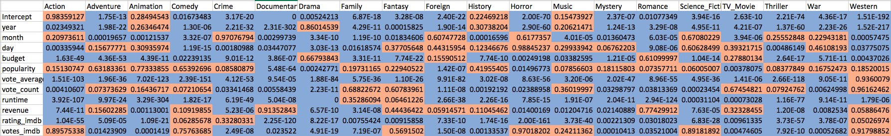
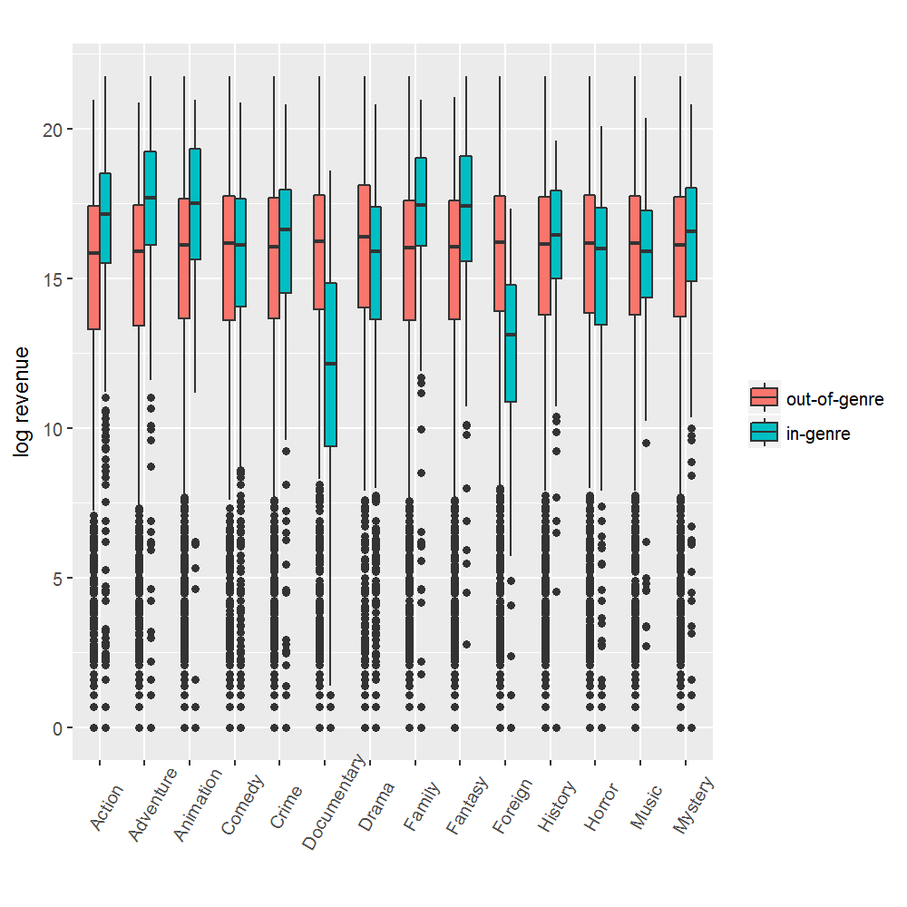
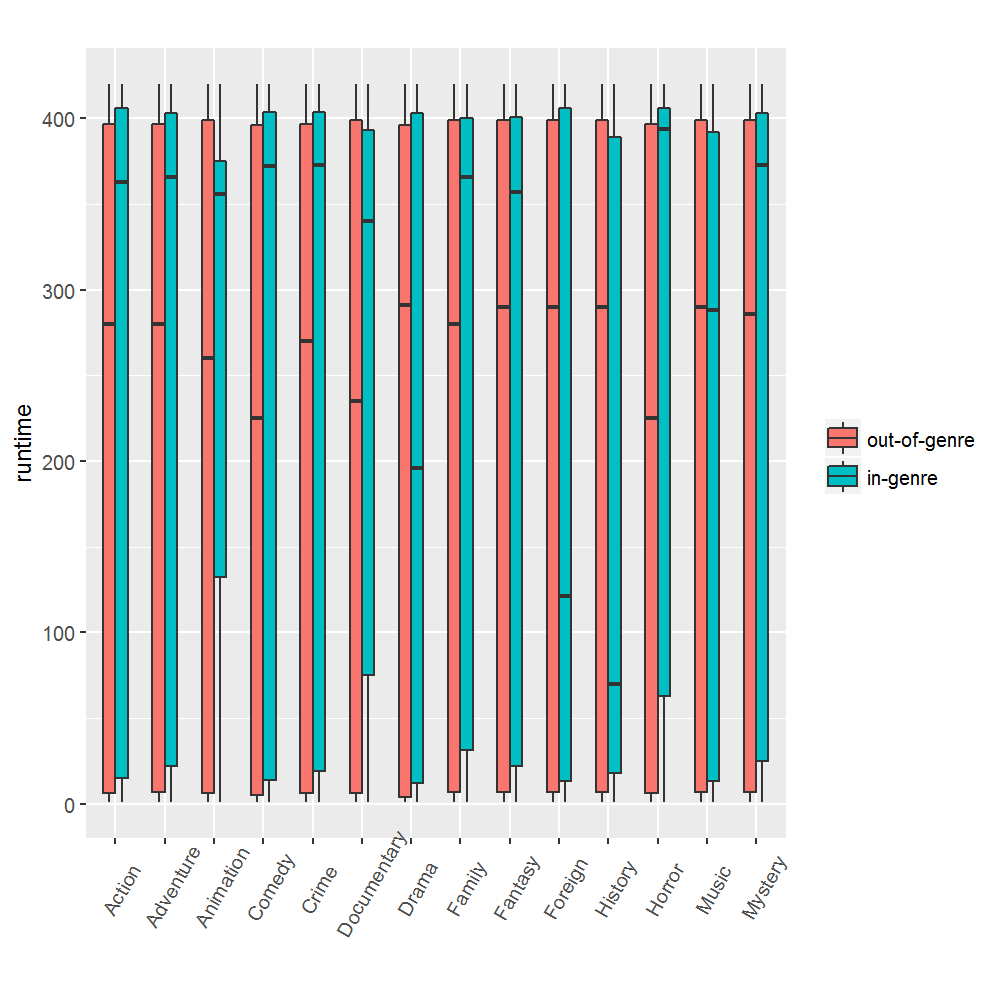
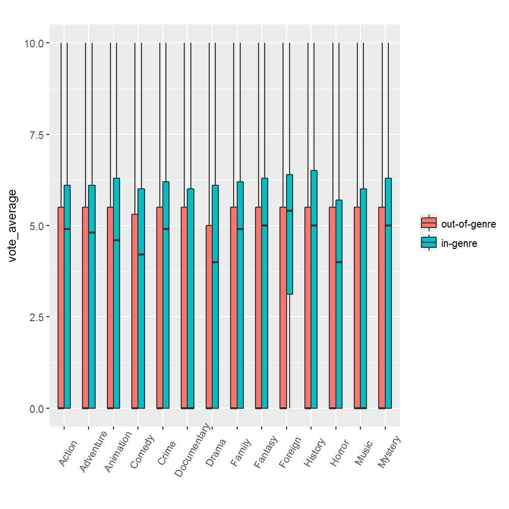
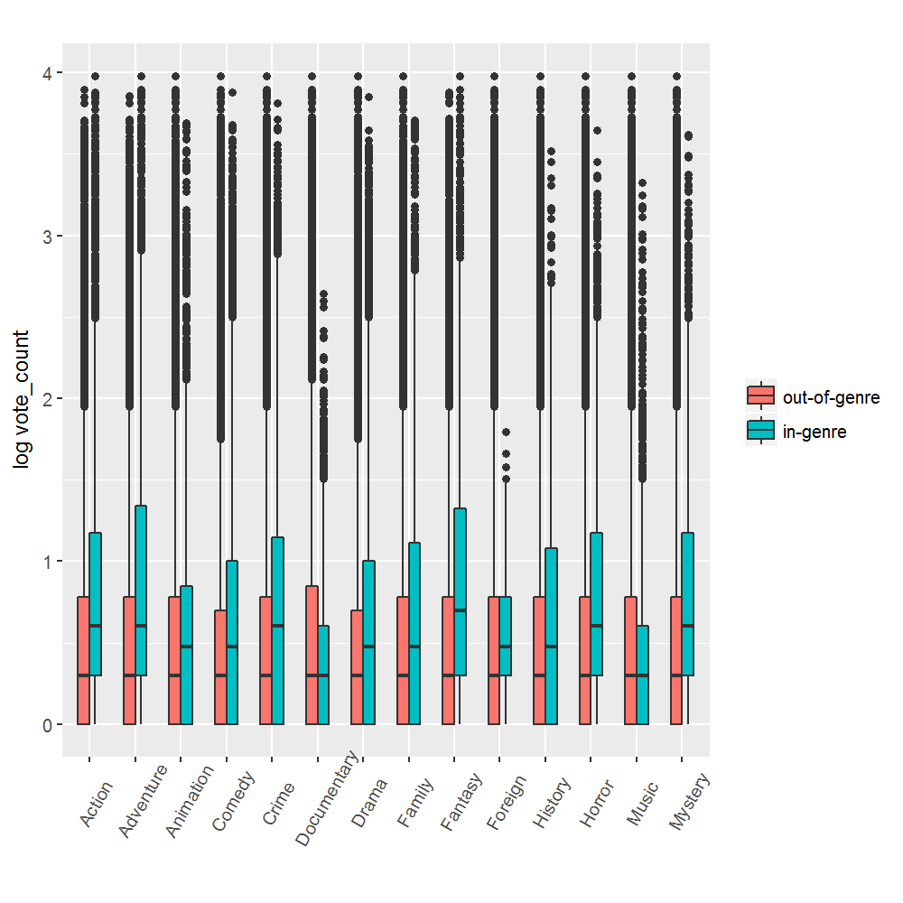
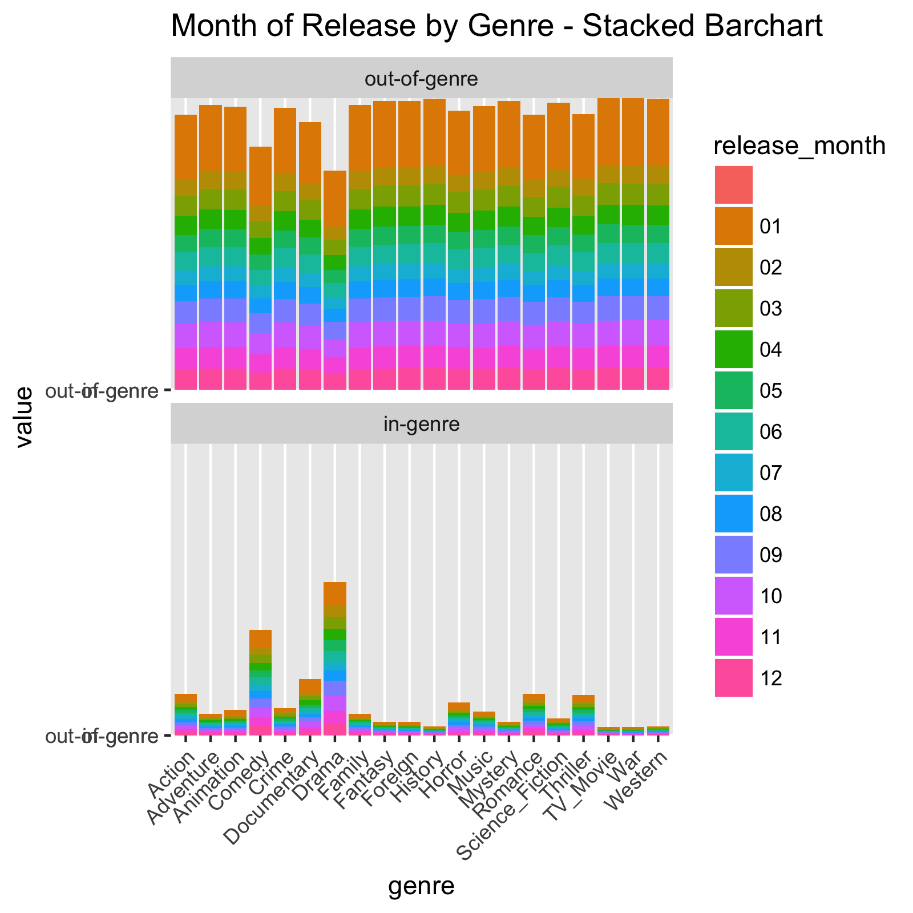
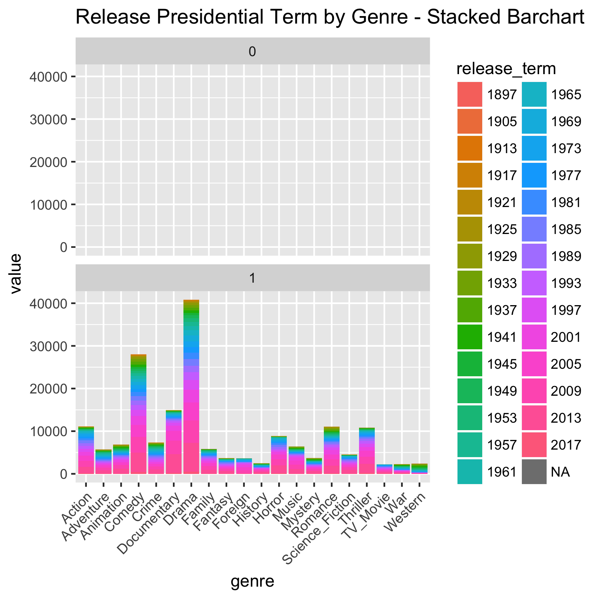
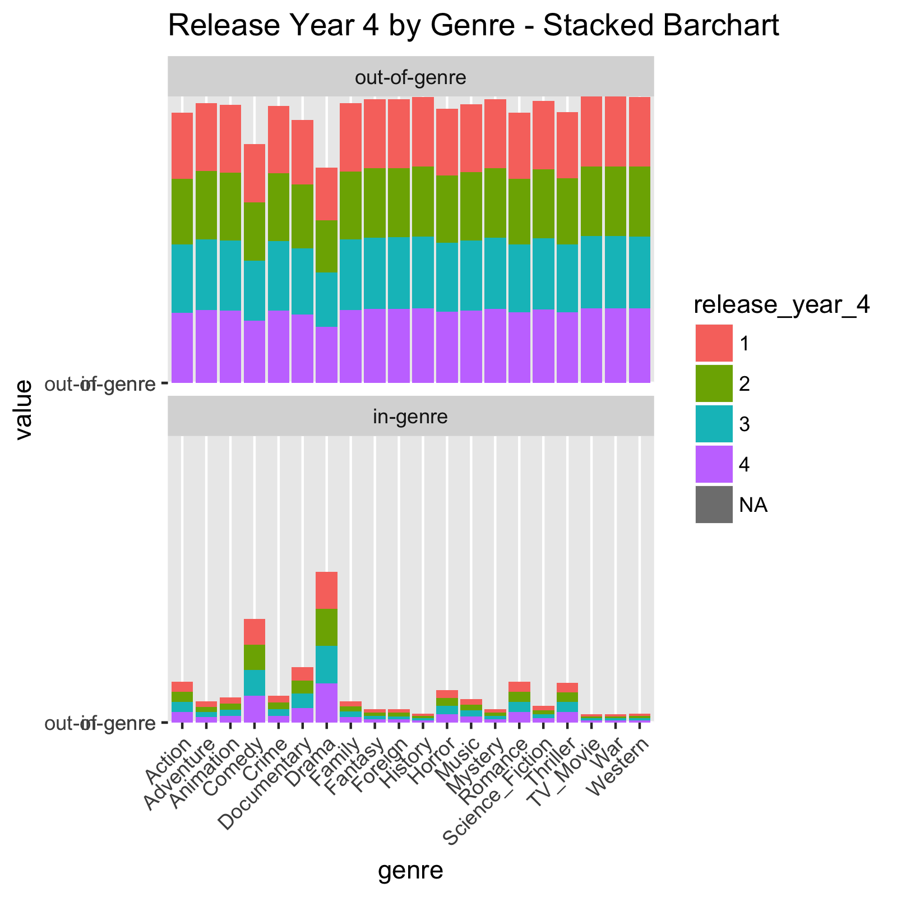
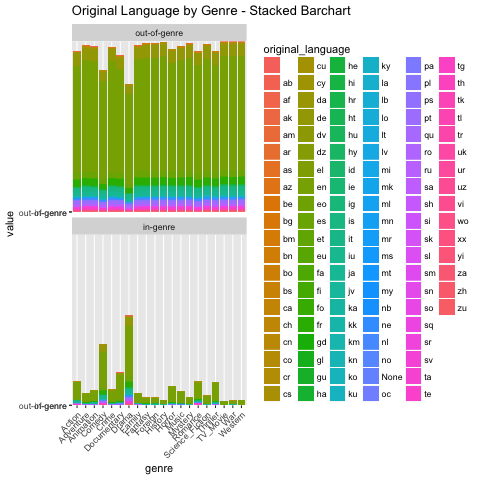

```{r setup, include=FALSE}
knitr::opts_chunk$set(echo = TRUE)
```

NB: Many of these topics we dealt with in the "Additonal Material" section of Milestone 1

_Discussion about the imbalanced nature of the data and how you want to address it_

The various genres have different base rates of occurance, none of which is particularly large. By modeling each genre separately, we can mostly ignore the differences between genres in base rates. For each model, we can provide class weights or use resampling to balance the in-genre and out-of-genre populations for those families of models where such balancing is needed.

_Description of your data_

*Column* | *Source* | *Description*
---------------- | ------- | -------------------------------------------
*tmdb_id* | TMDb | Our master key; all sources use this to join on
*release_date* | TMDb | When the movie was first released
*release_month* | TMDb | Derived from *release_date*, an integer between 1 and 12
*release_year* | TMDb | Derived from *release_date*, the year portion of it
*budget* | TMDb | Production budget - not trustworthy? Unclear whether it's in absolute or inflation-adjusted dollars
*original_language* | TMDb | Lots of very small languages, so we will replace this with dummy variables for the 5 most common values
*popularity* | TMDb | unclear what this means or if it's useful
*vote_average* | TMdb | The average of the votes for ratings of this movie on TMDb. Not useful
*vote_count* | TMDb | The number of votes for ratings of this movie on TMDb. Not useful
*runtime* | TMDb | In minutes.
*revenue* | TMDb | Also not necessarily trustworth. Unclear whether it's in absolute or inflation-adjusted dollars, or how they handle re-releases
*cast_score_genre_...* | TMDb + Team | For each genre, our computed "cast-genre affinity score" (see our discussion in Milestone 1)
*director_score_genre_...* | TMDb + Team | For each genre, our computed "director-genre affinity score" (see our discussion in Milestone 1)
*\{RGBHSV\}_Intensity_$n$* | TMDb + Team | For the pixels in the poster, for the channel R, G, B, H, S, or V, what are the top 5 values (0-255)?
*\{RGBHSV\}_Count_$n$* | TMDb + Team | For the pixels in the poster, for the channel R, G, B, H, S, or V, for the top 5 values, how many times does each occur in the image?
*imdb_id* | IMDb + TMDb | Key to query IMDb to obtain movie data and merge key for IMDb to TMDb
*votes_imdb* | IMDb | Number of votes. It could also be seen as the number of users who voted for the movie.
*rating_imdb* | IMDb | This is a numeric between 0 and 10, providing a "weighted average of the votes" given by users. The statistical method used to calculate rating has not been disclosed by IMDb.
*year_imdb* | IMDb | This is the year of release. Not useful, as we already have the same data from TMDb.
*canonical_title_imdb* | IMDb | This is the title of the movie. There is a lot we can do with this information (length of title, key words in title...etc.)
*kind_imdb* | IMDb | This serves as a categorization by one of the following: 'movie', 'tv series', 'tv mini series', 'video game', 'video movie', 'tv movie', 'episode'
*score_genre*_... \hbox{\qquad \_}*imdb_director* | IMDb + Team | For each genre, our computed "director-genre affinity score" (see our discussion in Milestone 1)
*score_genre*_... \hbox{\qquad \_}*imdb_cast* | IMDb + Team | For each genre, our computed "cast-genre affinity score" (see our discussion in Milestone 1)

_Use your application knowledge and the insight you gathered from your genre pair analysis and additional EDA to design Y. Do you want to include all genres? Are there genres that you assume to be easier to separate than others? Are there genres that could be grouped together? There is no one right answer here. We are looking for your insight, so be sure to describe your decision process in your notebook._

_What does your choice of Y look like?_

We addressed this in Milestone 1:

We have decided to treat each genre label as an independent outcome. Thus,
a romantic comedy would have `TRUE` for the `genre_Romance` and `genre_Comedy` columns. In particular, for each of the 19 genres in the TMDB data, we will 
create an independent model and use 0-1 loss. 

This approach has several advantages. 

First and second, it makes scoring our loss more
fair _and_ more productive. For example, if we successfully predict that the
romantic comedy is a "Romance" but fail to predict that it is a "Comedy", we 
want our accuracy to reflect that we were half correct -- and we want the feedback into our model to reflect _which_ half. 

Third, it eliminates the risk of creating a hand-curated list of hybrid
genres that will fail to predict some new fusion film that might occur in
the future.

Fourth, it allows us to use our "genre affinity" approach, as described
below, to affiliate actors and directors with the genres in which they
appear most often.


_Which features do you choose for X and why?_

Based on our initial decision to build separate models for each genre, we applied a generalized linear model to each genre separately using the features mentioned above. We've identified that almost all of the features are valuable predictors for at least one genre. We identified a feature's predictive value based on the respective p-values for a given genre. 

For example, we have identified that the following features are highly predictive for the genre Action: year, day, budget, vote_average, vote_count, runtime, revenue and rating_imdb. In addition, year, month, budget, vote_average, runtime, rating_imdb and votes_imdb are highly predictive features for the genre Adventure. We have mapped a different set of base features for each genre that we will use for further analysis. In the image below, blue p-values are less than .05 meaning that we can reject the null hypothesis.



What we have done so far is just the first step, and as we start building models, we'll follow a _mixed selection_ approach as discussed on page 79 of the textbook.
We will also use regularization techniques such as LASSO (and the equivalent for CNN models) to identify which of the remaining features can be omitted.

_How do you sample your data, how many samples, and why?_
We addressed this in Milestone 1:

We are separating our data as follows: We take the last digit of the movie's TMDB id. (We have verified that this seems to be evenly spread across years and genres.)

* If the last digit is 0-4, then this movie is training data from the get-go
* If it is 5, then this movie was test data for Milestone 1, and is added to the training data as of Milestone 2
* If it is 6, then this movie is test data for Milestone 2, and is added to the training data after that
* If it is 7, then this movie is test data for Milestone 3, and is added to the training data after that
* If it is 8, then this movie is test data for Milestone 4, and is added to the training data after that
* If it is 9, then this movie is test data for Milestone 5 (the final deliverable)

We will allow ourselves to "peek" ahead only to download related data (e.g., to make sure we have everything from IMDb early in the process).

\newpage

## Appendix A - Visualizations

This appendix contains visualizations of the features under consideration for use in our models.



We can see here certain genres for which `revenue` appears promising as a predictor, such as Adventure (where the median of in-genre is higher that the 75%ile of out-of-genre) and Documentary (where the median of in-genre is lower than the 25%ile of out-of-genre). There are also some genres (such as Comedy) where the IQRs for in-genre and out-of-genre are comparable, and so for the models for those genres we do not expect `revenue` to be a useful predictor.

\newpage


Here is an example of a visualization that indicates that `runtime` is not likely to be a useful predictor for most genres.

\newpage

\newpage

\newpage
Code for the preceding plots:

```{r eval=FALSE}
library(ggplot2)
library(scales)
```


```{r eval=FALSE}
tmdb <- read.delim('tmdb.tsv')
```


### budget
```{r eval=FALSE}
png('Boxplot for "budget".png', 1000, 1000, res=160)
# isolate data
tmdb_budget <- data.frame(budget = tmdb[,5], tmdb[,12:25])
colnames(tmdb_budget) <- sub('genre_', '', colnames(tmdb_budget))

#reshape data
tmdb_budget_melt <- melt(tmdb_budget, id.vars = "budget") 

#plot
ggplot(tmdb_budget_melt, aes(x = factor(variable),  y= log(budget), fill=factor(value)))+
  geom_boxplot(position=position_dodge(width=.50),  width = 0.5)+
  theme(axis.text.x=element_text(angle=60, hjust = 0.4, vjust = 0.6)) +
  labs(title = "",
       x = '',
       y = 'log Budget') +
  scale_fill_discrete(name="",
                      breaks=c("0", "1"),
                      labels=c("out-of-genre", "in-genre"))
graphics.off()
```

### popularity
```{r eval=FALSE}
png('Boxplot for "popularity".png', 1000, 1000, res=160)
# isolate data
tmdb_popularity <- data.frame(popularity = tmdb[,7], tmdb[,12:25])
colnames(tmdb_popularity) <- sub('genre_', '', colnames(tmdb_popularity))

#reshape data
tmdb_popularity_melt <- melt(tmdb_popularity, id.vars = "popularity") 

#plot
ggplot(tmdb_popularity_melt, aes(x = factor(variable),  y = log(popularity), fill=factor(value)))+
  geom_boxplot(position=position_dodge(width=.50),  width = 0.5)+
  theme(axis.text.x=element_text(angle=60, hjust = 0.4, vjust = 0.6)) +
  labs(title = "",
       x = '',
       y = 'log popularity') +
  scale_fill_discrete(name="",
                      breaks=c("0", "1"),
                      labels=c("out-of-genre", "in-genre"))
graphics.off()
```

### vote_average
```{r eval=FALSE}
png('Boxplot for "vote_average".png', 1000, 1000, res=160)
# isolate data
tmdb_voteaverage <- data.frame(vote_average = tmdb[,8], tmdb[,12:25])
colnames(tmdb_voteaverage) <- sub('genre_', '', colnames(tmdb_voteaverage))

#reshape data
tmdb_voteaverage_melt <- melt(tmdb_voteaverage, id.vars = "vote_average") 

#plot
ggplot(tmdb_voteaverage_melt, aes(x = factor(variable),  y= vote_average, fill=factor(value)))+
  geom_boxplot(position=position_dodge(width=.50),  width = 0.5)+
  theme(axis.text.x=element_text(angle=60, hjust = 0.4, vjust = 0.6)) +
  labs(title = "",
       x = '',
       y = 'vote_average') +
  scale_fill_discrete(name="",
                      breaks=c("0", "1"),
                      labels=c("out-of-genre", "in-genre"))
graphics.off()
```


### vote_count
```{r eval=FALSE}
png('Boxplot for "vote_count".png', 1000, 1000, res=160)
# isolate data
tmdb_votecount <- data.frame(vote_count = tmdb[,9], tmdb[,12:25])
colnames(tmdb_votecount) <- sub('genre_', '', colnames(tmdb_votecount))

#reshape data
tmdb_votecount_melt <- melt(tmdb_votecount, id.vars = "vote_count") 

#plot
ggplot(tmdb_votecount_melt, aes(x = factor(variable),  y= log(vote_count, base= 10), fill=factor(value)))+
  geom_boxplot(position=position_dodge(width=.50),  width = 0.5)+
  theme(axis.text.x=element_text(angle=60, hjust = 0.4, vjust = 0.6)) +
  labs(title = "",
       x = '',
       y = 'log vote_count') +
  scale_fill_discrete(name="",
                      breaks=c("0", "1"),
                      labels=c("out-of-genre", "in-genre"))
graphics.off()
```


### runtime
```{r eval=FALSE}
png('Boxplot for "runtime".png', 1000, 1000, res=160)
# isolate data
tmdb_runtime <- data.frame(runtime = tmdb[,10], tmdb[,12:25])
# remove movies with runtime = None
tmdb_runtime_removeNone <- tmdb_runtime[!tmdb_runtime$runtime=='None', ]
colnames(tmdb_runtime_removeNone) <- sub('genre_', '', colnames(tmdb_runtime_removeNone))

#reshape data
tmdb_runtime_melt <- melt(tmdb_runtime_removeNone, id.vars = "runtime") 

#plot
ggplot(tmdb_runtime_melt, aes(x = factor(variable),  y = as.numeric(runtime), fill=factor(value)))+
  geom_boxplot(position=position_dodge(width=.50),  width = 0.5)+
  theme(axis.text.x=element_text(angle=60, hjust = 0.4, vjust = 0.6)) +
  labs(title = "",
       x = '',
       y = 'runtime') +
  scale_fill_discrete(name="",
                      breaks=c("0", "1"),
                      labels=c("out-of-genre", "in-genre"))
graphics.off()
```


### revenue
```{r eval=FALSE}
png('Boxplot for "revenue".png', 1000, 1000, res=160)
# isolate data
tmdb_revenue <- data.frame(revenue = tmdb[,11], tmdb[,12:25])
colnames(tmdb_revenue) <- sub('genre_', '', colnames(tmdb_revenue))

#reshape data
tmdb_revenue_melt <- melt(tmdb_revenue, id.vars = "revenue") 

#plot
ggplot(tmdb_revenue_melt, aes(x = factor(variable),  y= log(revenue), fill=factor(value)))+
  geom_boxplot(position=position_dodge(width=.50),  width = 0.5)+
  theme(axis.text.x=element_text(angle=60, hjust = 0.4, vjust = 0.6)) +
  labs(title = "",
       x = '',
       y = 'log revenue') +
  scale_fill_discrete(name="",
                      breaks=c("0", "1"),
                      labels=c("out-of-genre", "in-genre"))
graphics.off()
```

\newpage

\newpage


\newpage


\newpage

